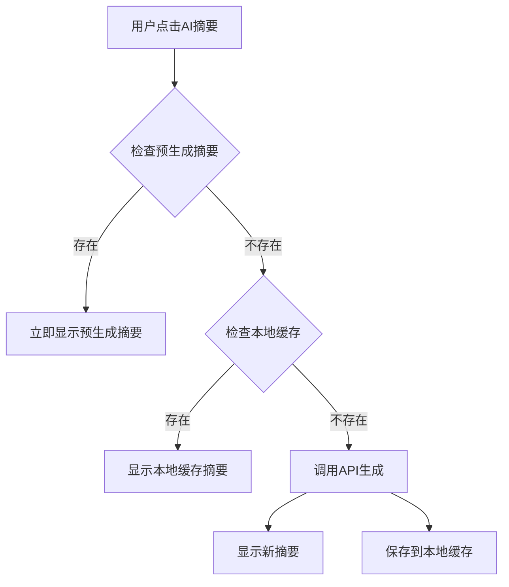

# AI摘要预生成使用指南

## 🎯 解决方案

现在AI摘要系统支持**预生成缓存**机制，实现你想要的效果：

1. **开发阶段**: 你在本地运行脚本预生成所有文章的AI摘要
2. **部署阶段**: 将预生成的摘要文件一起部署到服务器
3. **用户访问**: 用户第一次点击就能立即看到摘要，无需等待API调用

## 🚀 使用流程

### 步骤1: 安装依赖

```bash
cd anzhiyu-blog
npm install js-yaml  # 用于解析YAML配置文件
```

### 步骤2: 生成摘要

```bash
# 运行预生成脚本
node scripts/generate-ai-summaries.js
```

脚本会：
- 自动读取所有启用AI的文章（`ai: true`）
- 调用OpenAI API为每篇文章生成摘要
- 保存到 `public/data/ai-summaries.json` 文件

### 步骤3: 部署

正常部署你的博客，确保包含：
```
public/
├── data/
│   └── ai-summaries.json  ← 预生成的摘要文件
├── js/anzhiyu/
│   └── ai_abstract_openai.js  ← 更新后的缓存逻辑
└── ...其他文件
```

## 🎯 工作原理

### 缓存优先级

1. **预生成摘要** (最高优先级)
   - 从 `/data/ai-summaries.json` 读取
   - 用户第一次点击就能立即显示
   - 无需任何API调用

2. **本地缓存** (中等优先级)  
   - 用户浏览器的localStorage
   - 用于存储用户自己生成的摘要

3. **实时生成** (最低优先级)
   - 当前两种缓存都没有时才调用API
   - 生成后保存到本地缓存

### 🔄 **完整流程**



## 📝 脚本使用说明

### 基本用法

```bash
# 生成所有文章的摘要
node scripts/generate-ai-summaries.js
```

### 高级选项

你可以修改脚本来支持：

```javascript
// 只生成特定文章的摘要
const targetPosts = ['文章1.md', '文章2.md'];

// 批量处理时的延迟设置
const apiDelay = 1000; // 1秒延迟避免API限制

// 自定义输出路径
const customOutputPath = './custom-summaries.json';
```

## 🔧 配置选项

### 在 `_config.anzhiyu.yml` 中配置：

```yaml
post_head_ai_description:
  enable: true
  mode: openai
  openai:
    apiKey: "your-api-key"
    apiUrl: "https://api.siliconflow.cn/v1/chat/completions"
    model: "Qwen/Qwen3-30B-A3B"
    maxTokens: 500
    temperature: 0.7
    systemPrompt: "你是一个专业的技术博客文章摘要助手..."
```

## 📊 优势对比

| 方案 | 用户首次访问 | API调用 | 服务器要求 | 维护成本 |
|------|-------------|---------|------------|----------|
| **原方案** | 等待2-5秒 | 每次都调用 | 无 | 低 |
| **客户端缓存** | 等待2-5秒 | 首次调用 | 无 | 低 |
| **预生成缓存** | 立即显示 | 预生成时调用 | 静态文件 | 中等 |

## 🎯 最佳实践

### 开发工作流

1. **写文章时**: 正常写作，设置 `ai: true`
2. **发布前**: 运行预生成脚本
3. **部署时**: 确保包含 `ai-summaries.json` 文件
4. **更新时**: 重新运行脚本更新摘要

### 自动化建议

可以将预生成集成到你的部署流程中：

```yaml
# GitHub Actions 示例
- name: Generate AI Summaries
  run: |
    cd anzhiyu-blog
    npm install js-yaml
    node scripts/generate-ai-summaries.js
    
- name: Deploy
  run: |
    # 部署包含预生成摘要的public目录
```

## 🔍 故障排除

### 常见问题

1. **脚本运行失败**
   - 检查OpenAI API配置是否正确
   - 确认网络连接正常
   - 验证API Key是否有效

2. **摘要文件不生效**
   - 确认文件路径 `/data/ai-summaries.json` 可访问
   - 检查JSON格式是否正确
   - 验证文章URL匹配是否准确

3. **部分文章没有预生成摘要**
   - 确认文章Front Matter中有 `ai: true`
   - 检查文章解析是否成功
   - 查看脚本运行日志

## 🎉 总结

现在你的AI摘要系统实现了：

- ✅ **用户零等待**: 预生成摘要让用户第一次点击就能立即看到内容
- ✅ **成本控制**: 只在开发时调用API，用户访问不产生费用
- ✅ **高可用性**: 即使API服务异常，用户仍能看到预生成的摘要
- ✅ **灵活部署**: 只需要静态文件，适用于任何托管平台

这是一个完美的解决方案，既满足了用户体验需求，又控制了API调用成本！🎊
